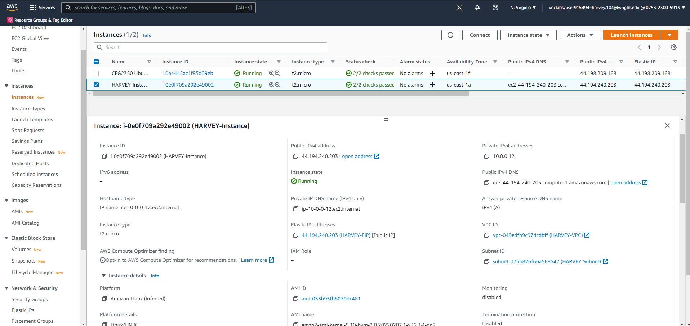
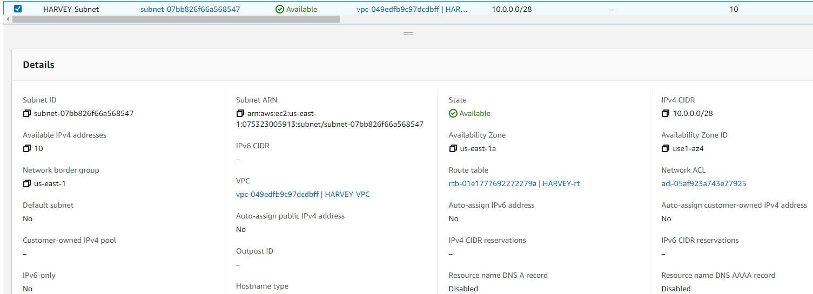
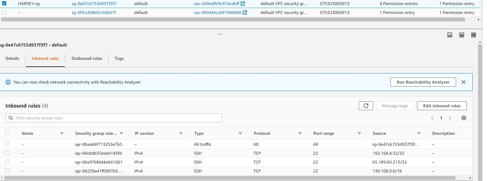
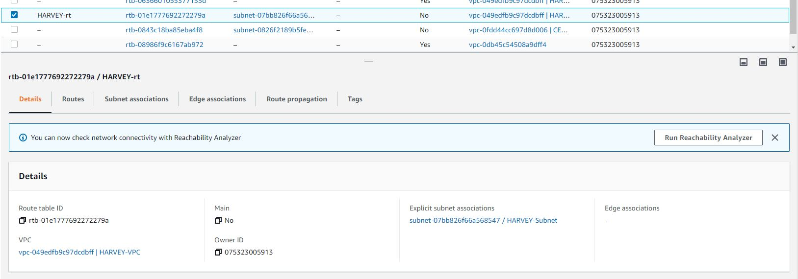
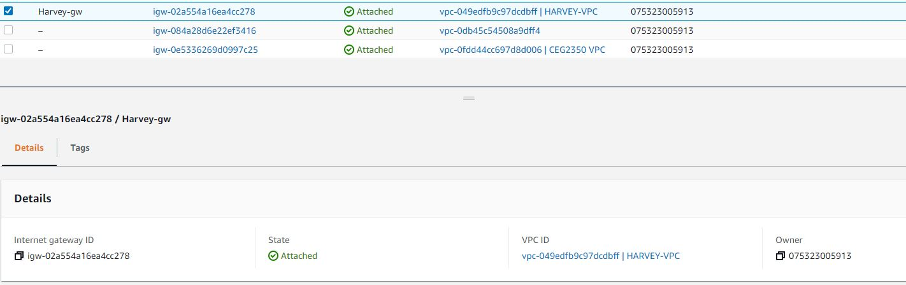
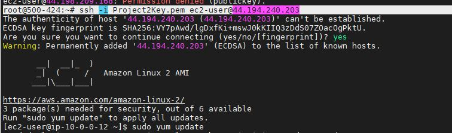
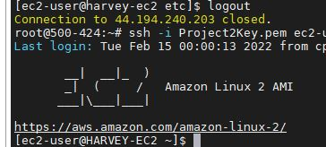

Building an Amazon Image given tools:

	This project was to see if I could build an instance of a personal machine
	with minimal functionality and talking. 
	
		1) building the machine
			- Construction of this was relatively simple, with following the wizard
			  and tutorial given making things mush easier and ensuring I didn't 
			  break anything in the process. 
			
			- The instance itself was pretty easy: Pick an AMI(basically an OS, but that's oversimplification)
			  and I set up an IP range to pick from and a name. From what I observed, it will pick an IP
			  at random and stick with it, unless specified. I kept the auto-assigned one is 
			  convenience.
			  
			  -  The AMI I picked was an Amazon Linux 2 AMI which was the first one on the top of the selections available.
			
			- The instance type was a t2.micro, which was relatively cheap and just the right size for a dummy test AMI 
		
			
						
			- I also needed a subnet, a security rule, an internet gateway, and a route table. All of these were basically name and forget,
			  EXCEPT the security group. There, it was imperative to add a whitelist for all inbound traffic so not everyone
			  could say hello to my machine. My inbound rules added were for My home IP, the WSU, general IP block, and the IP of the machine itself.
			  
			  
			  
			  
			  
			  
			  
			  
			  
			  After all of this construction, it's time to log in!
			  
			  
			  To personalize this AMI, I decided to change my username with 
			  
			   > sudo hostnamectl set-hostname NEW_HOSTNAME
			And here is my new username
				