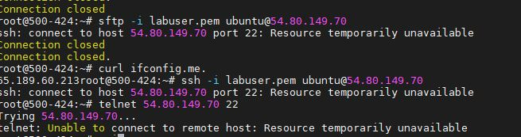

Setting up Haproxy on the server: 
 
Using the tools to install it was relatively easy, but I had to make sure that the template commands worked, 
so I tested each command on the command line once I initiated the template..

SSH between Haproxy server and the webservers:

You have to SSH from haproxy into the private web server addresses because the security rules only allow ssh from the load balancer.

I started to configure my haproxy config files, and I think I was on the right path, but I was unable to test it to prove it was working.

Unfortunately, at this point, I started getting "resource temporarily unavailable" for my remote host, probably to timing out one time. 
I regrettably thought I could get all my screencaps at the end, but the current issues are plaguing my instance. 

